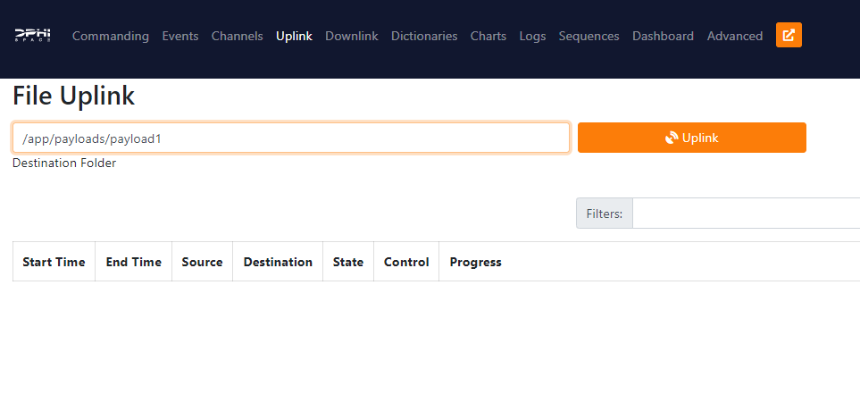
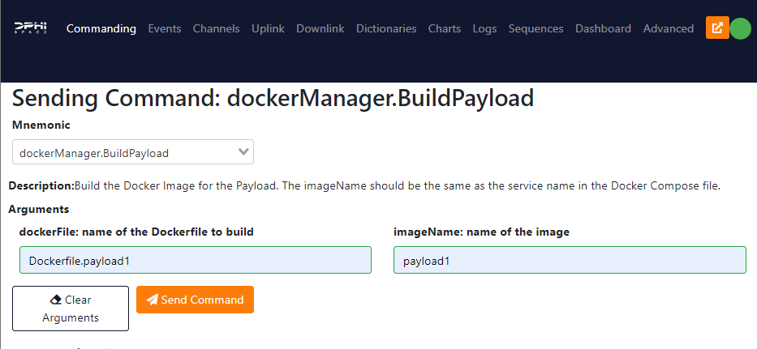

# FSCompose


## Setup
### 1. Install Docker 
Checkout this guide 

[https://docs.docker.com/engine/install/](https://docs.docker.com/engine/install/)

### 2. Clone the git 

   ```bash
   git clone https://github.com/DPhi-Space/FSCompose.git
   cd FSCompose
   ```
   
### 3 Build the Payload Docker Image

We provide an example in `payload-example/` folder. You can use this as a template to build your own payload. Then run the following command inside the `payload-example/` folder:
   ```bash
   cd payload-example/
   docker build -f Dockerfile.payload1 -t payload1:latest .
   cd ..
   ```

The `payload1:latest` image will be used by the Docker Compose to create the container for the payload. So the tag name `payload1` should be used in the `docker-compose.yml` file.


### 3 Run Docker Compose 

The Docker Compose includes the containers for the main Flight Software(FS), the Ground Data Segment(GDS) and the Payloads. When running it, it should pull the images from the Docker Hub.

#### a) Start FS, GDS and Payloads together.

   ```bash
   docker compose up -d
   ```

#### b) Start FS and GDS only.
   
   ```bash   
   docker compose up -d fsw gds
   ```
      
The FS will try periodically to connect to ports 50001 and 50002. Create a Python script that starts a TCP server on those ports. Example provided in `example.py`

### 4 Using the GDS 

Now you can use the GDS to send commands to the FS. The GDS is a web application that can be accessed at :

[127.0.0.1:5000/](http://127.0.0.1:5000/)


#### Data Folder

Each payload defined in the Docker Compose will have a shared folder with the main FS container. The folder is mounted at `/data/` inside the Payload container, and should be used for the data that needs to be downlinked. 

#### Sharepoint Folder

This folder is used to share files between Payload Containers. It is mounted at `/sharepoint/` inside the Payload container.  


#### Uplink Files from GDS to Data Folder
Go to the **Uplink** Tab and and type the following destination path:

   ```bash
   /app/payloads/payload1
   ```
   
Then select the file you want to uplink and click on the **Uplink** button. This will Uplink this file to the `/data/` folder inside the Payload Container.



#### Downlink Files from Data Folder to GDS

#### Start and Stop the Payload Container

To start a payload container, which is defined in the Docker Compose, go to the **Commanding** Tab and select the **dockerManager.Start** command as shown below:

   


**Attention**: The service name needs to match the name of the service defined on the Docker Compose. In this case, the service name is `payload1`. 

Press the **SendCommand** button and the Payload Container will be started. Press the **StopCommand** button to stop the Payload Container.

#### Build a new Docker Container on the fly
It is also possible to build a new Docker Container for your Payload. To do that, go to the **Commanding** Tab and select the **dockerManager.BuildPayload** command as shown below:

   

This will execute the following bash command:

   ```bash
   docker build -t Dockerfile.payload1 -t payload1:latest .
   ```
You can check the correct execution of this command on the **Events** Tab.

#### Check Logs
   


### 5 Stop Docker Compose

   ```bash
   docker compose down
   ```