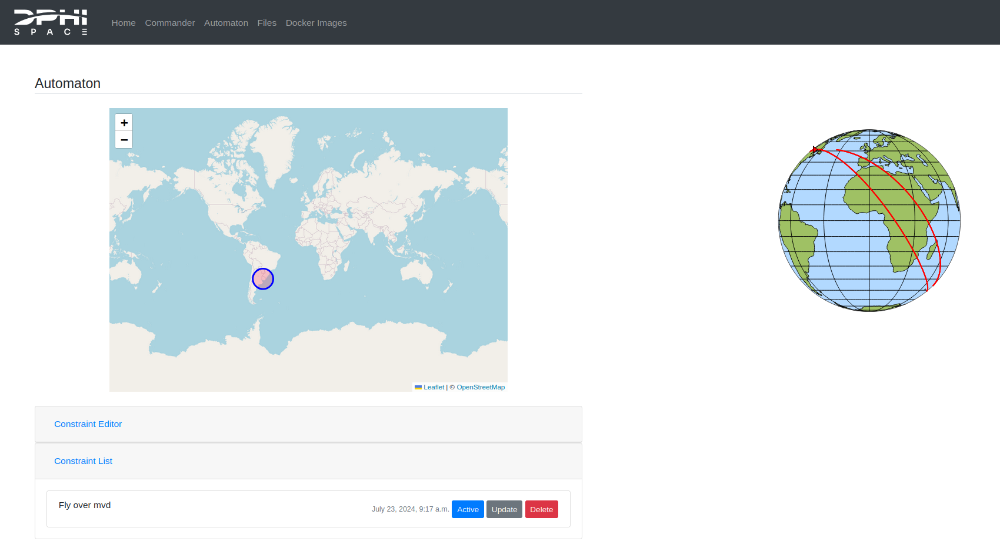

# Ground Segment

The Ground Segment (GS) provides a web interface to centralize commanding and coordinations of the Flight Software (FS). It compiles commands and groups files to be uplinked to the FS when requested to, and it is meant to be used for both the development and operations phases of a payload by the user.

Below you will find an overview of the different tabs.

### Home

The _Home_ tab provides a quick overview of the following points:

- **Current Compute Usage**: shows in a pie chart the total execution time for each compute node (_i.e._ MPU, GPU or FPGA) used on-board.

- **Weekly Downlink Overview**: shows in a graph chart the total size of downlinked data in bytes for the last week.

- **Current Downlink Usage**: shows the total amount of data downlinked since the start of operations.

This values will be resetted before the operations start.

### Commander

The _Commander_ tab is where users will request for commands to be executed on the DPhi Space FS. The commands that are supported are explained in [Commands](./Commands.md).

The _Command Sequence Editor_ allows the user to create command sequences.

The _Command Files_ lists all the created command files. The user can update, delete or activate them. When a command file is activated, they will be tagged for execution when requested by the FS Interface, which will fetch the activated command files and send them to the running FS instance.

### Automaton

TODO

### Files

The _Files_ tab allows a user to upload files to the GS, which will be sent to the FS if request, and gives an overview of the following files :

-**Uploaded Files** Files uploaded to the GS by the user. They can be deleted, downloaded or requested to be uplinked.

-**Downlinked Files** Files that have been downlinked from the FS by a previous command execution. The files can be requested to be downlinked by either the _On-Board Files_ downlink button below or by the _downlink_ command in a command sequence.

-**On-Board Files** Files that are in the user's volume in the FS. The user can request to delete them or downlink them if needed, which will be done on the next command sequence execution.

- **On-Board Log Files** Log Files collected throughout the execution of the FS that concern the user. When a Docker Container is started by a user, all of it's standard output (_i.e._ stdout, any type of _print()_ in python or _std::cout<<"Hello world"<<_ will be logged here.). They can also be requested to be deleted or downlinked, which will be done on the next command sequence execution.

### Docker Images

The _Docker Images_ tab allows user to request Docker Images to be loaded on the FS. It is strongly advised to do this early in development. The requested Docker Images need to support OS/ARCH linux/arm64 or linux/aarch64. This [link](https://hub.docker.com/search?architecture=arm64&type=image) provides a list of all the Docker Images in Docker Hub that support this architecture.

### Profile

The _Profile_ tab provides a simple overview of the user's account information.

## Next Step

Now we have everything to interface with the Flight Software:

[Flight Software](../4.FS/README.md)
