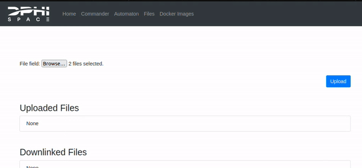
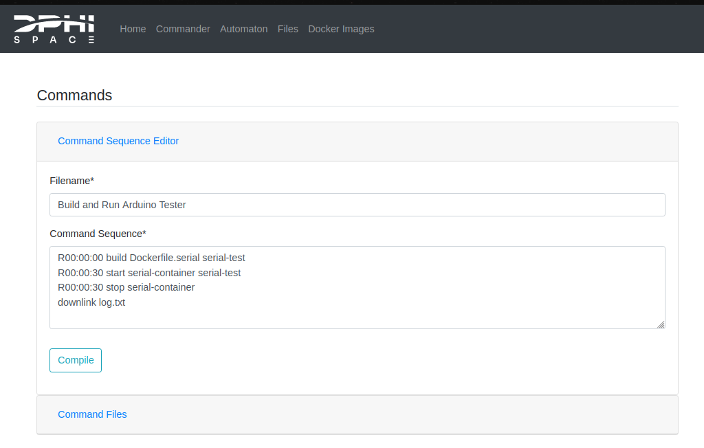
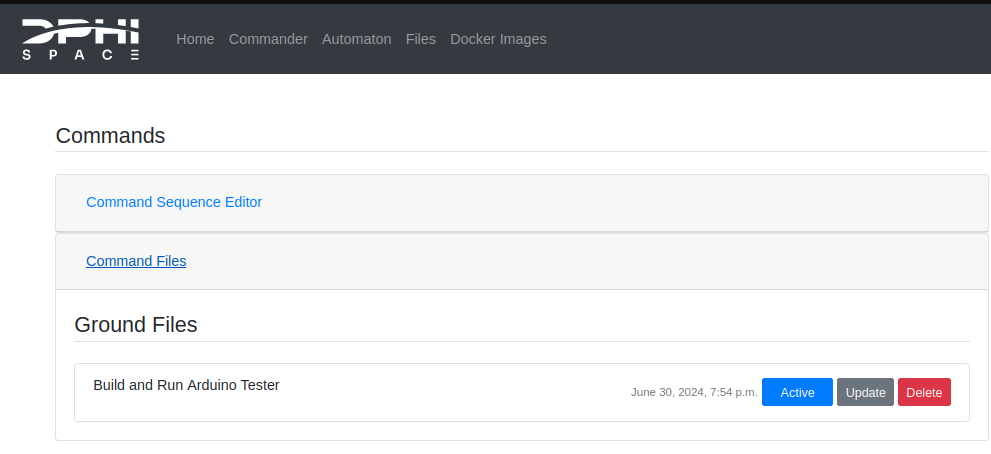
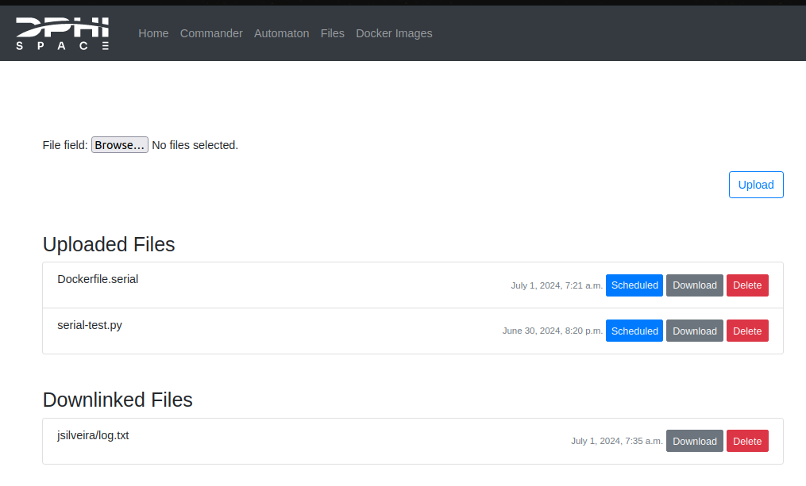

# Example: Serial Payload

In this example we will be going through the development and deployment pipeline of the FSCompose suite. We will run a Python script that interfaces with an Arduino MEGA, which will simulate a serial payload that responds to certain commands. Then we will Dockerize this script and interface with the same Arduino and finally, once this standalone Docker Container is validated, we will deploy it inside the FSCompose through the whole pipeline. 

If you have not already cloned the repo, do so by running the following:

```bash
$ git clone git@github.com:DPhi-Space/FSCompose.git
$ cd FSCompose/
```
## Payload Overview

The Arduino will act as a simple payload which will respond to certain commands. Below is the command that will be running in it : 

```arduino
#define OPCODE_ALIVE  0x0000
#define OPCODE_TEMP   0x00A1


void setup() {
  Serial.begin(9600);
  Serial.println("Ready to receive commands");
}

void loop() {
  if (Serial.available() >= 2) {
    byte input[4];
    for (int i = 0; i < 2; i++) {
      input[i] = Serial.read();
    }

    // Decode OpCode and Data
    unsigned int opCode = (input[0] << 8) | input[1];

    // Handle command
    switch(opCode) {
      case OPCODE_ALIVE: // ALIVE
        Serial.println("I am Alive");
        break;
      case OPCODE_TEMP: // GET_TEMP
        sendTemperature();
        break;
      default:
        Serial.println("Unknown command");
        break;
    }
  }
}

void sendTemperature() {
  // Example function to send temperature
  float temperature = 25;
  Serial.print("Current Temperature: ");
  Serial.println(temperature);
}
```

As you can see, it simply waits for a message over serial and decodes it. If it is a valid OpCode, it will answer back one of the three messages available, *i.e.*:

- *I am Alive*
- *Current Temperature: 25*
- *Unkown command*


## First Step: Direct Communication
The aim of our Docker Container will be to validate that the Arduino is behaving as expected. Therefore, we will create a Python script that sends the *OpCodes* it is expecting, records the response and validates them with what we would expect from it if it is correctly running.

As previously mentionned, we will first start by directly interfacing the Arduino with the Python script mentionned above. Below is the code for it : 

```python 
import serial
import struct
import time
import shutil

OPCODE = 0
EXPECTED_MSG = 1

expected_bootup = 'Ready to receive commands'
commands = {
    'alive'     : [0x0000, 'I am Alive'],
    'temp'      : [0x00A1, 'Current Temperature: '],
    'unknown'   : [0xFFFF, 'Unknown command']
}

ser = serial.Serial('/dev/ttyACM0', 9600)
time.sleep(2)

# Open log file
log_file = open('log.txt', 'w')

def print_and_log(message):
    print(message)
    log_file.write(message + '\n')

def send_command(op_code):
    command = struct.pack('>H', op_code)
    ser.write(command)
    time.sleep(0.1)
    response = ser.readline().decode('utf-8').strip()
    return response

def print_aligned(description, value, expected, equal=None):
    if equal is not None:
        msg = f"{description:30} | {value:50} | {expected:50} | {equal:10}"
    else:
        msg = f"{description:30} | {value:50} | {expected:50}"
    print_and_log(msg)

def run_test(command_name):
    op_code = commands[command_name][OPCODE]
    expected_msg = commands[command_name][EXPECTED_MSG]
    
    response = send_command(op_code)
    result = response.startswith(expected_msg)
    
    print_aligned(f'Response to {command_name.upper()}:', response, expected_msg, "Passed" if result else "Failed")
    
    return result

print_aligned('Waiting for bootup message...', '', '')
print_aligned("", "Received Message", "Expected Message")

bootup_msg = ser.readline().decode('utf-8').strip()
bootup_result = bootup_msg.startswith(expected_bootup)
print_aligned('Bootup message:', bootup_msg, expected_bootup, "Passed" if bootup_result else "Failed")

time.sleep(2)

test_results = []

for command_name in commands:
    test_passed = run_test(command_name)
    test_results.append(test_passed)

ser.close()

print_and_log("\nTest summary:")
print_and_log(f"{'Command':30} | {'Expected':50} | {'Result':10}")
print_and_log("-" * 95)

for command_name, result in zip(commands.keys(), test_results):
    expected_msg = commands[command_name][EXPECTED_MSG]
    result_str = "Passed" if result else "Failed"
    print_and_log(f"{command_name.upper():30} | {expected_msg:50} | {result_str:10}")
 
print_and_log("-" * 95)
print_and_log(f"Total tests     : {len(test_results)}")
print_and_log(f"Tests passed    : {test_results.count(True)}")
print_and_log(f"Tests failed    : {test_results.count(False)}")

# Close log file
log_file.close()

try:
    shutil.copy('log.txt', './data/log.txt')
except Exception as e:
    # Open the log file again to log the error
    with open('log.txt', 'a') as log_file:
        log_file.write(f"Data directory not mounted. Failed to move log.txt.\n")
    print(f"Data directory not mounted. Failed to move log.txt.")

while True:
    time.sleep(10)
```

As you can see, we keep a dictionary of the commands,`commands`, which stores both the OpCode for the given command and what is expected as a response message in nominal operations. 

We will iterate over the commands, send them, wait for the answer and validate them with what is expected. And do the same for each command. We will be logging the data produced by the script in the `log.txt` file.


Remember that, when running the Docker Container in the FSCompose, only the data stored in the `/data` volume is visible to the FS. This is for data privacy issues of course. As we want to downlink the produced `log.txt`, we need to transfer it to this volume at the end of execution. Which is what we do in the last lines: 

```python
log_file.close()

try:
    shutil.copy('log.txt', './data/log.txt')
except Exception as e:
    with open('log.txt', 'a') as log_file:
        log_file.write(f"Data directory not mounted. Failed to move log.txt.\n")
    print(f"Data directory not mounted. Failed to move log.txt.")
```

We wrap this part around a `try except` so that we can run the script locally, without needing to create a data folder. In this case it will simply raise a warning, but still create the `log.txt`. 

Connect the Arduino, verify which port it is using and adapt the following line if it differs : 

```python
ser = serial.Serial('/dev/ttyACM0', 9600)
```
> ⚠️ Before running the script, make sure you have installed the `pyserial`  module : 
> ```bash
> $ pip install pyserial 
> ```


Now we are ready to run the script : 
```bash
$ python3 serial-test.py
```
At the end of the execution, you should see the following standard output: 

```bash
Waiting for bootup message...  |                                                    |                                                   
                               | Received Message                                   | Expected Message                                  
Bootup message:                | Ready to receive commands                          | Ready to receive commands                          | Passed    
Response to ALIVE:             | I am Alive                                         | I am Alive                                         | Passed    
Response to TEMP:              | Current Temperature: 25.00                         | Current Temperature:                               | Passed    
Response to UNKNOWN:           | Unknown command                                    | Unknown command                                    | Passed    

Test summary:
Command                        | Expected                                           | Result    
-----------------------------------------------------------------------------------------------
ALIVE                          | I am Alive                                         | Passed    
TEMP                           | Current Temperature:                               | Passed    
UNKNOWN                        | Unknown command                                    | Passed    
-----------------------------------------------------------------------------------------------
Total tests     : 3
Tests passed    : 3
Tests failed    : 0
Data directory not mounted. Failed to move log.txt.
```

All test passed! As expected, we failed to move the log.txt file to the `app/data/` volume, as it is not mounted of course. We are good to go for the next step, dockerizing the script.

## Second Step: Communicating within Docker

To create a Dockerfile for this script, we need to know which are the packages and libraries it will need to run correctly. In our case, we will need to install the `pyserial` package, for it communicate through serial with the Arduino.

The resulting Dockerfile is shown below: 

```docker
FROM python:3.9-slim

WORKDIR /app

COPY ./serial-test.py /app/

RUN pip install pyserial

CMD ["python3","-u", "serial-test.py"]
```


It is as simple as it gets. We just copy the script inside the Docker Image and install the only package that is not included in the `python:3.9-slim` base image.


>❓ The `-u` flag when executing the script simply -u forces the stdout and stderr streams to be unbuffered. Meaning, it will immediately print the prints within the Docker Container to the console running it. 

Lets start by building the Docker Image. In a folder with both the Dockerfile and the previous Python script (*e.g.* `payload-example/serial-payload/`) run the following in the terminal:

```bash
$ docker build -f Dockerfile.serial -t test-serial .
```
Here we are building the `Dockerfile.serial` file, which instructs how to build the resulting Docker Image, and we tag it `test-serial` (*i.e.*, we name it that).

You should see the following output : 

```
[+] Building 10.4s (9/9) FINISHED                                                                                                                                                      docker-container:fs-builder
 => [internal] load build definition from Dockerfile.serial                                                                                                                                                   0.0s
 => => transferring dockerfile: 155B                                                                                                                                                                          0.0s
 => [internal] load metadata for docker.io/library/python:3.9-slim                                                                                                                                            1.3s
 => [internal] load .dockerignore                                                                                                                                                                             0.0s
 => => transferring context: 2B                                                                                                                                                                               0.0s
 => [internal] load build context                                                                                                                                                                             0.0s
 => => transferring context: 2.76kB                                                                                                                                                                           0.0s
 => CACHED [1/3] FROM docker.io/library/python:3.9-slim@sha256:d3185e5aa645a4ff0b52416af05c8465d93791e49c5a0d0f565c119099f26cde                                                                               0.0s
 => => resolve docker.io/library/python:3.9-slim@sha256:d3185e5aa645a4ff0b52416af05c8465d93791e49c5a0d0f565c119099f26cde                                                                                      0.0s
 => [2/3] COPY ./serial-test.py /                                                                                                                                                                             0.0s
 => [3/3] RUN pip install pyserial                                                                                                                                                                            8.2s
 => exporting to docker image format                                                                                                                                                                          0.8s 
 => => exporting layers                                                                                                                                                                                       0.3s 
 => => exporting manifest sha256:a90ee52697e7a7935f80aaf219f542cb49f95a2e6961eda9d08165d56f3ce71e                                                                                                             0.0s 
 => => exporting config sha256:41b44c0a79fd7f0d37e22439741e0313cbcab447dd7a46c292b92b903589a1ad                                                                                                               0.0s 
 => => sending tarball                                                                                                                                                                                        0.5s 
 => importing to docker                                                                                                                                                                                       0.2s 
 => => loading layer f4fd562e86ff 1.14kB / 1.14kB                                                                                                                                                             0.2s
 => => loading layer d0061f673095 32.77kB / 2.84MB
```

If we simply run it, the script will fail as it will try to open the `/dev/ttyACM0` serial port. Docker isolates the process from everything unless specified basically. So we need to attach the serial device to it when running it. This is done with the `--device` flag: 


```bash
$ docker run --device /dev/ttyACM0 test-serial
```

As before, we get should get the same output. Now we are ready for the last step, building and running the Docker Container within the FSCompose suite.

## Third Step: FSCompose

### Running local deployment of FS
To kick off this part, we need to ensure that we can pull the necessary Docker Images that will run the local deployment of the FSCompose. Start by login in to the DPhi Space Docker Registry with the credentials that have been provided:

```bash 
$ docker login ops.dphi.space
Username: [username]
Password: [password]
```
Before running the local FS, we need to adapt the `providers.json` file, which tells this deployment which device it should attach to which provider (*i.e.* the user running the deployment). Open it up and set the following parameters: 

- **name** set this to the same Username you used to login into the [GS Dashboard](http://ops.dphi.space:8000/login/).
- **devices** set this to the serial port to which the Arduino is connected. 
- **payloads** set this to *arduino* (or whatever name pleases you).

```yaml
{
    "providers": [
        {
            "name": "[**Username**]",
            "devices": ["/dev/ttyACM0"],
            "payloads": ["arduino"]
        }
    ]
}
```

Run the `run.sh` script, which will setup the local deployment of the FS:

```bash
$ ./run.sh
```

You should see the following output at the end, when all the components of the FS have been started: 

```bash
# (...)
######################################

Setup done! Ready to fly.
Press 'q' to quit: 
```


### Preparing files in the  GS
The FS we started in the previous step is analogous to the FS that will be running in Clustergate, and Payload Providers interface with it through the GS Dashboard. For local development we will follow the same pipeline. Head to the [GS Dashboard](http://ops.dphi.space:8000/login/) and login with your credentials. 

Then head to the **Files** tab, were we will be uploading the necessary files to run our Docker Container, *i.e.* the `Dockerfile.serial` and the `serial-test.py`. Do so and set them to be uplinked by clicking on the **Uplink** button. This should be the result : 



Now we need to create a *Command Sequence* to tell the when to build and when to start the Docker Container inside the FS. Head to the **Commander** tab and create a new *Command Sequence*. 

As this is the first time we will be running this Docker Image, we need to build it at least once. Below is a *Command Sequence* that builds it and 10 seconds later, it starts it : 


```
R00:00:00 build Dockerfile.serial serial-test
R00:00:30 start serial-container serial-test
R00:00:30 stop serial-container
downlink log.txt
```



Here we are telling the FS to do the following : 
1. Build the `Docekerfile.serial` and tag the resulting Docker Image to `serial-test`, immediately.
2. Start a Docker Container called `serial-container` from the `serial-test` Docker Image 30 seconds later.
3. Stop the Docker Container called `serial-container` 30 seconds later.
3. Downlink the generated `log.txt`

Go ahead and compile it, head to the *Command Files* and set the *Command Sequence* to *Active* as shown below: 



Now we are ready to run the FS Interface to link the FS and the GS.

### Running FS Interface 

Now we have everything ready. Run the FS Interface software by running the script and logging in with the same credentials used for the GS Dashboard. You should see the following output: 

```bash
$ python3 main.py
Connecting to  0.0.0.0 50000
Starting FS Interface
Username: [username]
Password: [password]
Login successful
Starting fs-interface...

Press e to execute Command Sequence
Press s to send downlink.zip to GS
Press q to quit

Waiting for Instructions
```

Press *e* and enter for it to fetch everything it needs from the GS and *uplink* it to the (local) FS. Now after a minute or two, the script will receive the `downlink.zip`, and show the output below: 


```bash
Waiting for downlink files...
Waiting for downlink files...
Received File  downlink.zip
Waiting for Instructions
```

The `downlink.zip` contains file and folder insights (*i.e.* which files are present in the `app/data/` volume of the user and which logs are available for *downlink*). Plus, we will se the `log.txt` file we requested for downlink at the end of the *Command Sequence*.

Press *s* to send the `downlink.zip` to the GS automatically. You can also inspect it locally if you prefer. In the **Files** tab, you should now see the following: 



The file can be directly downloaded from there by clicking the **Download** button.


## Debugging

If fore some reason you suspect the FS Interface is waiting in vain for the FS to send the `downlink.zip`, because the later one failed to execute the Command Sequence, or the Docker Container failed to launch, you can run the following script : 


>⚠️ Make sure you can launch the script by giving it permission to be executed:
> ```bash
> $ sudo chmod +x debug.sh
> ```

```bash
$ ./debug.sh
```

This will copy from the FS the files in your `app/data/` folder, which is where the Dockerfiles and scripts are transferred to, and also the log files of the Docker Images and Containers the FS tries to build and to execute:

```bash
$ ./deploy.sh
Successfully copied 22kB to /home/jsilveira/DPhi/FSCompose/debug/

Fetched the following files from FS:
./debug/
├── jsilveira
│   ├── Dockerfile.serial
│   ├── log.txt
│   ├── pdb_fun.py
│   ├── serial-test.py
│   └── user.json
├── logs-file-tree.log
├── providers-file-tree.log
├── serial-container.log
├── serial-test.log
├── unzip-logs.log
└── zip-files.log

1 directory, 11 files

```