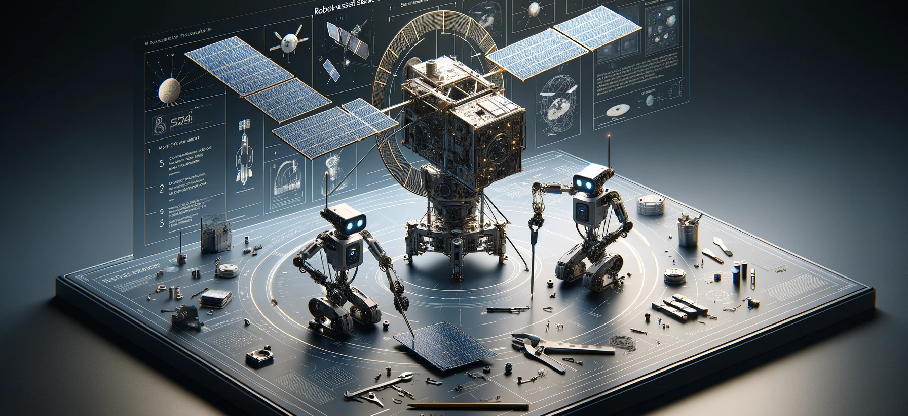

Welcome to the FSCompose User Guide for the DPhi Space Flight Software!

## Overview
1.  [Introduction](./sections/introduction.md)
2.  [Setup](./sections/setup.md)
3.  [GDS GUI](./sections/gds.md)

## Examples and Case Studies
1.  [Controlling an Arduino Nano](./sections/examples/nano/ex-nano.md)
2. [PiCamera and the Red Giant Star Mission](./sections/examples/pi-camera/ex-pi-camera.md)

## Reporting Issues and Bugs 🐛
Please report any issue, bug, warning or suggestions in the following link : 

[https://github.com/DPhi-Space/FSCompose/issues](https://github.com/DPhi-Space/FSCompose/issues)