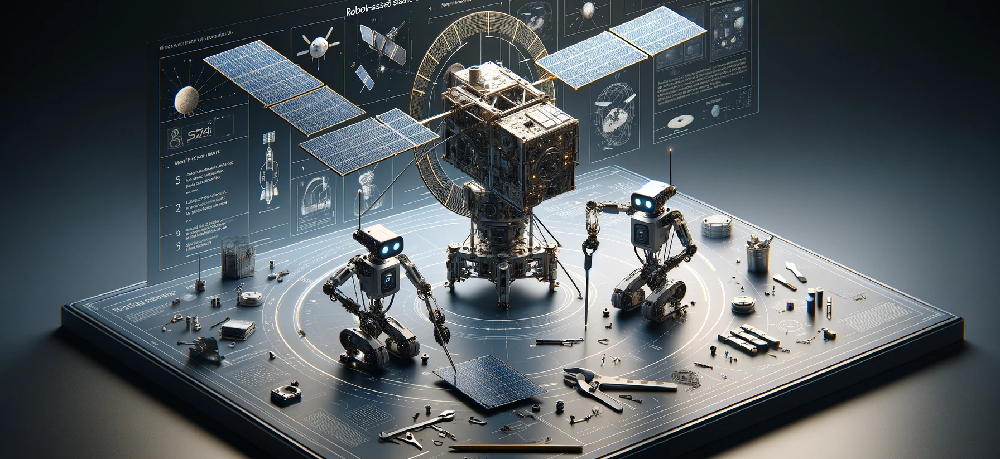

Welcome to the FSCompose User Guide for the DPhi Space Flight Software!

## Overview
1.  [Introduction](./1.Introduction/README.md)
2.  [Setup](./2.Setup/README.md)
3.  [Dashboard](./3.GroundSegment/README.md)
4.  [Flight Software](./4.FS/README.md)
5.  [Apps](./5.Apps/README.md)

## Examples
[Hello World](./6.Examples/Hello-World/README.md)

## Reporting Issues and Bugs 🐛
Please report any issue, bug, warning or suggestions in the following link : 

[https://github.com/DPhi-Space/FSCompose/issues](https://github.com/DPhi-Space/FSCompose/issues)