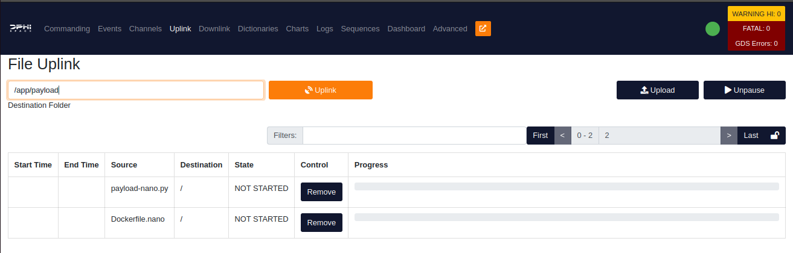
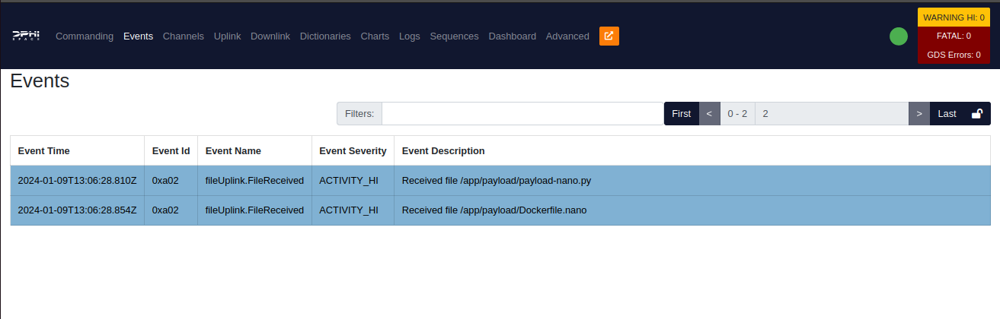
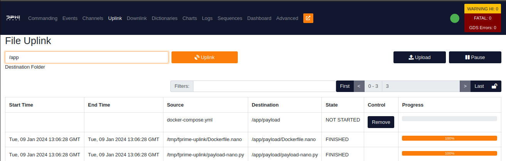
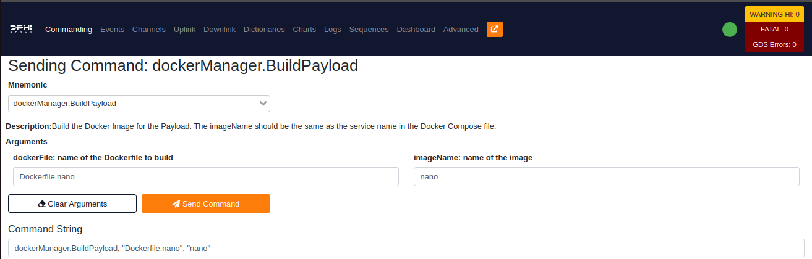
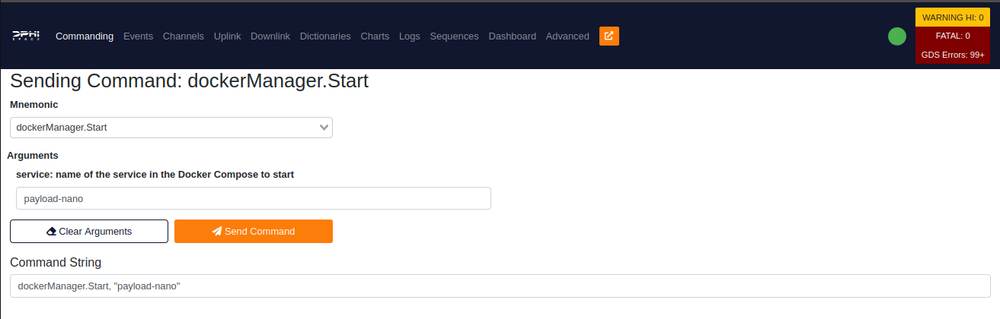

# Arduino Nano Control

## Introduction 
In this example, we will be controlling an Arduino Nano from within the FSCompose software suite. The payload setup is quite simple, as shown below.


The Arduino is quite a simple subsystem in this example. It receives messages of 1 byte in size and executes a LED pattern according to the byte received. It has a total of 7 patterns. The code can be found under `payload-example/arduino-nano/`.

The Arduino communicates through serial with a Python script. We will go through the three expected stages of development : 
1. **Direct interfacing** with the script running on the PC.
2. **Containarized interfacing**, where the script runs inside a Docker Container.
3. **FSCompose interfacing**, where the previous Docker Container is uploaded to the FSCompose, built and then ran from the GDS GUI.

Let's get started.

## Direct Interfacing

The Python script is as follows :

```python
import serial
import time 

ser = serial.Serial("/dev/ttyACM0", 115200)
packet = bytearray()

for i in range(0x00, 0x07):
    packet.append(i)
    ser.write(packet)
    time.sleep(5)
```

It is the standard Python way to interface with a serial device. Almost a direct copy-paste of what you can find on Stackoverflow. Which will come in handy, as developers we want to fly as we develop and develop as we fly. No need to adapt to an SDK. No need to adapt to an API. No need to adapt to the hardware. 

>⚠️ Before running the script make sure to correctly configure the serial port. 

Now, run the script by executing the following in the terminal: 

```bash
python3 payload-nano.py
```

>⚠️ Make sure you have the necessary permissions to access the serial port. If, when running the script, you get the following error : 
> ```bash
>   OSError: [Errno 13] Permission denied: '/dev/ttyACM0'
>```
> Then run the following command : 
> ```bash
>   sudo chmod +666 /dev/ttyACM0
>```


## Containarized Interfacing
Now, we want to containarize this application. This encapsulates the application and adds to it's general reliability. The Dockerfile we'll be using is quite simple : 

```docker
ARG     VARIANT="22.04"
FROM    ubuntu:${VARIANT} as base

ARG     DEBIAN_FRONTEND=noninteractive

WORKDIR /app

RUN     apt-get update && apt-get install -y --no-install-recommends \
        build-essential \
        python3 \
        python3-setuptools \
        python3-pip 

RUN     pip install pyserial

COPY    ./payload-nano.py ./payload.py

CMD     python3 -u payload.py 
```

Inside the folder containing both the script and the Dockerfile (in our case `/payload-example/arduino-nano/`), run the following in the terminal to build the image: 

```bash
$ docker build -f Dockerfile.nano -t nano .
```

And after it successfully builds, we can run it by executing the following in the terminal : 

```bash
$ docker run nano
```

This will raise an error in the Python, as we have not exposed the serial device to the container for it to interface with the arduino. The correct command is : 

```bash
$ docker run --device /dev/ttyACM0 nano
```

>⚠️ Once again, make sure the serial device you are exposing to the container is the correct one. 

Let's say in the Python script we set the serial device to be `/dev/ttyACM0`, but the serial device in the PC keeps changing for whatever reason. We can map it to always be `/dev/ttyACM0` inside the container by running 

```bash
$ docker run --device /dev/ttyUSB0:/dev/ttyACM0 nano
```

Where `/dev/ttyUSB0` is the serial device in the PC. This might be different for you of course.

Now run the Docker Container again and enjoy the LED show.


## FSCompose Interfacing

Now the FSCompose suite. Follow the [setup guide](../../setup.md) if not already done to get started with installation. Let's start by launching the FSCompose suite : 

```bash 
$ sudo ./run.sh
```

This will launch the core Flight Software (FS) and the GDS GUI to interface with it at the following address : 

[http://127.0.0.1:5000/]()


Open it on your browser of choice. Let's upload the files we need to build the Docker Image for our payload. Go to the **Uplink** Tab and select the `payload-nano.py` script and the `Dockerfile.nano` and set the *Destination folder* to `/app/payload`, as shown below:




Uplink the files by pressing on the orange *Uplink* button. You can verify the correct uplink in the **Events** Tab, which should show the following events: 




Now we are almost ready to build it. One last detail, we need to update the Docker Compose file to include this new service. Remember, it is the **fsw** Container that will manage your Payload Container, and it has an internal copy of the `docker-compose.yml` file, which needs to be updated to include the new payload. All of this will be automated when your payload is in space, but for testing and development freedom reasons, we leave this up to the developers during the development phase. Let's append the following code to the `docker-compose.yml` file : 

>⚠️ This step is a hotfix and will be automated in the future. Payload Providers won't need to do this in the future.

```docker
  payload-nano:
    image: nano:latest
    volumes:
      - payload:/app/data
      - sharepoint:/app/sharepoint
    networks:
      my_network:
        ipv4_address: 172.30.0.10
    devices:
      - "/dev/ttyACM0:/dev/ttyACM0"           
```

The *caveats* are the following: 
- `payload-nano` this is the name of the service. It is used as an argument for the *dockerManager.Start* and *dockerManager.Stop* commands.
- `image: nano:latest` this is the name of the image this service should search for. This must coincide with the second argument of the *dockerManager.BuildPayload* command, which sets the name of the container being built.
- `volumes:` sets up the shared volumes with the core flight software and other containers if they wish to share data.
- `network:` sets up the IP address of this service within the local network Docker creates.
- `devices:` this is probably the most important setting, as it exposes the serial device of the host computer running the whole Docker Compose suite to this specific service. Meaning that, if you have an arduino connected to `/dev/ttyACM0` in the host computer, you can forward that port to this service by defining and rename it to `/dev/ttyUSB0`(so you don't have to adapt the port's name inside the service). 

Now we will uplink the file to the `/app` folder, as such: 



Let's build the payload inside the **fsw** now. Go to the **Commanding** Tab and send the *dockerManager.BuildPayload* command with the arguments shown below:



The first argument is the name of the Dockerfile we uploaded, in our case it is `Dockerfile.nano`. The second argument is the name of the Container Image, as we have defined in the `docker-compose.yml` file. In our case, it is `nano`.
If the build has succeded, we are ready to start the container. Send the *dockerManager.Start* command with the following argument: 




This time, enjoy both the LED show and successfully finishing the necessary integration, software-wise, to fly with DPhi Space!


## Bonus: Let's *C* the LED show

The Payload Controller is a simple Python script, but it can be written in any language. Let's say we want to write it in C. We can do so by writing the following code : 

> This example is both for demonstrating the flexibility of the FSCompose suite and for apeasing the hardcore embedded systems C fans out there. 


```c
#include <fcntl.h>
#include <termios.h>
#include <unistd.h>
#include <stdio.h>
#include <string.h>

int main() {
    const char *port = "/dev/ttyACM0";
    int serial_port = open(port, O_RDWR);

    if (serial_port < 0) {
        perror("Error opening serial port");
        return 1;
    }

    // Set serial port settings
    struct termios tty;
    memset(&tty, 0, sizeof(tty));
    if (tcgetattr(serial_port, &tty) != 0) {
        perror("Error getting serial port attributes");
        close(serial_port);
        return 1;
    }

    cfsetospeed(&tty, B115200);
    cfsetispeed(&tty, B115200);

    tty.c_cflag &= ~PARENB; // No parity
    tty.c_cflag &= ~CSTOPB; // One stop bit
    tty.c_cflag &= ~CSIZE;  // Clear character size mask
    tty.c_cflag |= CS8;     // 8 data bits
    tty.c_cflag &= ~CRTSCTS; // No hardware flow control
    tty.c_cflag |= CREAD | CLOCAL; // Enable reading and ignore modem control lines

    // Set input mode (non-canonical, no echo, ...)
    tty.c_lflag &= ~(ICANON | ECHO | ECHOE | ISIG);

    // Set output mode (raw output)
    tty.c_oflag &= ~OPOST;

    // Apply settings
    if (tcsetattr(serial_port, TCSANOW, &tty) != 0) {
        perror("Error setting serial port attributes");
        close(serial_port);
        return 1;
    }

    // Write a specific byte to the serial port
    unsigned char byte_to_write = 0x01;
    while(byte_to_write < 0x08){
        ssize_t bytes_written = write(serial_port, &byte_to_write, 1);

        if (bytes_written < 0) {
            perror("Error writing to serial port");
        } else {
            printf("Successfully wrote %zd bytes to %s\n", bytes_written, port);
        }
        byte_to_write++;
    }
    // Close the serial port
    close(serial_port);

    return 0;
}

```

So let's go through the same steps as before, but this time with the C code.
### Direct Interfacing
Let's compile the code and run it : 

```bash
$ gcc payload-nano.c -o payload-nano
$ ./payload-nano
```

### Containarized Interfacing
Of course, we'll need to adapt the docker file accordingly: 

```docker
ARG     VARIANT="22.04"
FROM    ubuntu:${VARIANT} as base

ARG     DEBIAN_FRONTEND=noninteractive

WORKDIR /app

RUN     apt-get update && apt-get install -y --no-install-recommends \
        build-essential

COPY    ./payload-nano.c ./payload-nano.c

RUN     gcc ./payload-nano.c -o payload-nano

CMD     ./payload-nano
```

Now we are ready to build the docker image and run it : 

```bash
$ docker build -f Dockerfile.nano -t nano .
$ docker run --device /dev/ttyACM0 nano
```

### FSCompose Interfacing
 

As before, we'll need to uplink the files to the **fsw** and update the `docker-compose.yml` file. The steps are the same as for the python script, so we'll skip them. 

Congratulations! You have successfully integrated (again) your payload with the FSCompose suite!


## Next Steps
[Controlling a PiCamera](../pi-camera/ex-pi-camera.md)