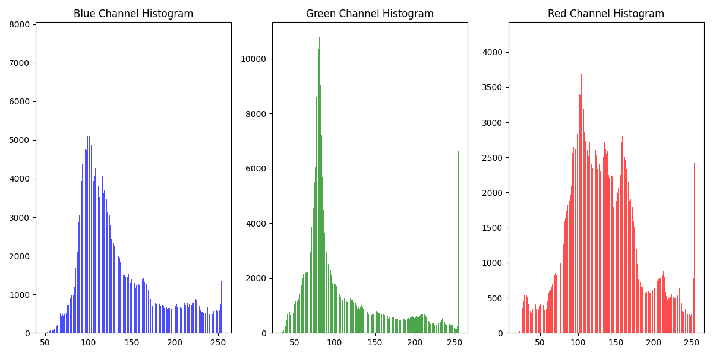

# RaspberryPi Camera Control

## Introduction

Here we will present a more complex use case of FSCompose. The payload will be a Raspberry Pi 4 and a Pi Camera module connected to it, and the whole system communicates through TCP. Once a connection is establish, the payload captures images and sends them to the TCP client, which in our case is the *camera-controller.py* script. We will go through the three different stages of development in detail as we did with the Arduino Nano example. Let's start with the mission description for our payload, to better understand why we are doing what. 

## Mission Description

The objective is to take footage of a Red Giant Star. Our camera payload is on-board a DPhi Satellite going at high speeds close to the objective. So fast indeed that the payload needs to take multiple images at a given time and analyse them to ensure we have actually captured an image of it and not of empty space. This is a one in a life-time opportunity and we cannot afford to miss the shot.


## Step 1: Payload Development Phase

We design the software for the payload, which is a python script `camera-payload.py` that outputs the captured images every half a second to the host DPhi satellite. 

To avoid missing the perfect shot of our Star, we will take 400 pictures when we are near it to account for positional uncertainty of the Host satellite. We will need to start the capture 30 seconds before the ETA to the Star. The amount of data the payload will be generating is too important for a downlink, especially considering how far our payload has travelled to capture the giant. Therefore we will need to rely on on-board processing to analyse and figure out which will be the perfect image. But our payload hardware invested too much into the imaging hardware and almost nothing on the computing hardware. We'll rely on DPhi's edge computing OBC for the on-the-fly data processing.

## Step 2: Pipeline Development Phase 

Now we'll focus on the payload controller software, which will be running on the OBC. For convenience sake, we'll develop it on python. But it can be also done on C, C++, Rust or Assembly if that suits you more.

So we need to develop a script that receives 400 pictures from the TCP, analyses all of them and keeps the one with the highest red values. We'll produce a histogram of the RGB Colors for this image, save the image and a log text which enumerates the maximum red threshold for each of the 400 images. 

However, we do not want the images to be shared with the core software on the DPhi OBC, for privacy reasons. Therefore, we won't be storing them directly in the **data volume** mounted at `/app/data`. We'll just transfer the results of the analysis to this folder for downlink. 

>💡 To also ensure privacy along the downlink pipeline, the payload controller should implement encryption of this data before transferring it to the `/app/data` volume. Then decryption can be performed after downlinking it from the GDS GUI. 


The resulting script is the `camera-controller.py`.

We are ready to test this raw, with no containarization. First let's run the script on the Raspberry Pi : 

```bash
$ python3 camera-payload.py
```

And then we run the camera controller script : 

```bash
$ python3 camera-controller.py
```

Now we start receiving the images, and wait for the 400 images to arrive. Now let's check the results. In the `data/` folder we get the the `histogram.png`, `frame_XXX.png` and the `red_threshold.txt` log data.



Now let's containarize it !

## Step 3: Containerizing the Payload Controller
At this stage, we are ready to containarize our payload controller software. This will ensure better software reliability and isolation. 

The Dockerfile is the following one : 

```Dockerfile

# Use an official Python runtime as a parent image
FROM python:3.8-slim-buster

# Install additional dependencies
RUN apt-get update && \
    apt-get install -y libgl1-mesa-glx libglib2.0-0 libxkbcommon-x11-0

# Set the working directory to /app
WORKDIR /app

# Copy the current directory contents into the container at /app
COPY . /app

RUN mkdir -p /app/images

# Install any needed packages specified in requirements.txt
RUN pip install --no-cache-dir opencv-python numpy matplotlib

# Make port 5050 available to the world outside this container
EXPOSE 5050

# Define environment variables
ENV SERVER_IP "192.168.1.158"

# Run app.py when the container launches
CMD ["python", "-u","./camera-controller.py"]
```

We build the container image on top of the `python:3.8-slim-buster`, which is an official Python Docker Image. We install the necessary dependencies and Python libraries (*opencv*, *numpy* and *matplotlib*, mainly for the data processing side). To build it, run the following command : 

```bash
$ docker build -f Dockerfile.camera -t camera .
```

And we run it with : 

```bash
$ docker run -d camera
```

This will run the container in the background. Let's analyse the files inside it. Run the following to access the container's bash:

```bash
$ docker ps --format "{{.Names}}"
CONTAINER_NAME

$ docker exec -it CONTAINER_NAME bash

$ cd data/

$ ls
frame_94.png  histogram.png  red_threshold.txt
```

Great! Now let's do the software integration with FSCompose.

## Step 4: FSCompose Software Integration
As for the Arduino Nano example, we will start by uplinking the necessary files to run the payload controller, which are : 

 - `camera-controller.py`
 - `Dockerfile.camera`

These are necessary to build the payload controller container inside the FSCompose. Let's launch the FSCompose by running the run script: 

```bash
$ sudo ./run.sh
```

Give it a few seconds and it should open the web browser. If it does not, go to the following address:

http://127.0.0.1:5000/

Go to the **Uplink** Tab and uplink them to the `/app/payload` as shown below : 


Now we need to add the camera controller service to the `docker-compose.yml`. Add it after the *Payload* banner, as shown below : 

```Dockerfile
version: '3'
services:
 
    (...)

##############################################################
########################## Payloads ##########################
##############################################################
     
  payload-camera:
    image: camera:latest
    volumes:
      - payload:/app/data
    networks:
    my_network:
        ipv4_address: 172.30.0.11
    ports:
      - 5050:5050
    
    (...)

volumes:
  payload:  
  sharepoint:
```

> 📚 For more details on this please check the Arduino Nano and GDS GUI guides.


Now, we are ready to build the container. Go to the **Commanding** Tab and send the following *dockerManager.BuildPayload* command, as shown below:


To run the payload controller, send the following command:


And now we wait for the 400 images of our payload ⌛.


## Step 5: Downlinking Data
