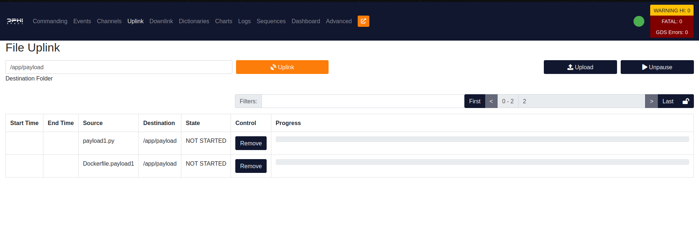
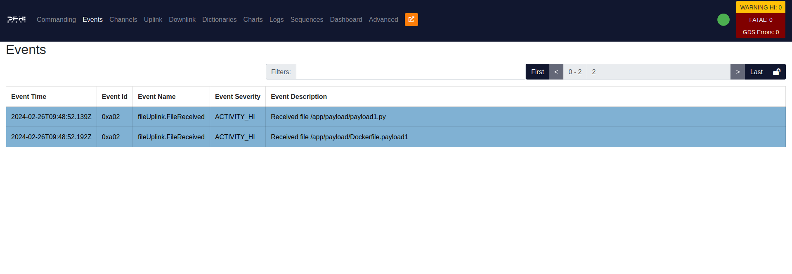
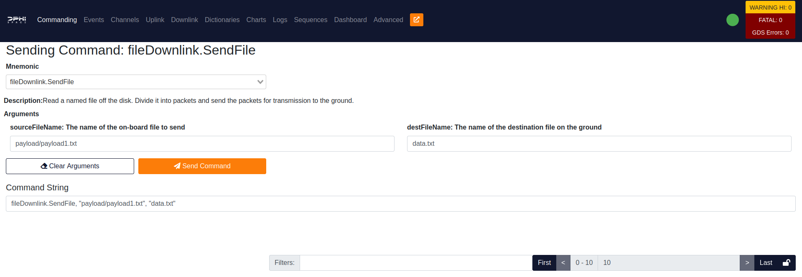
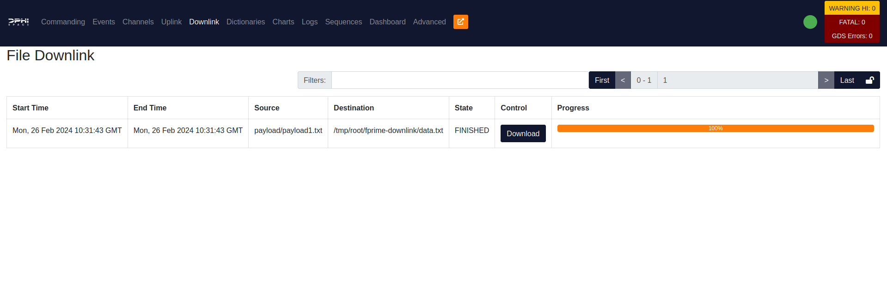
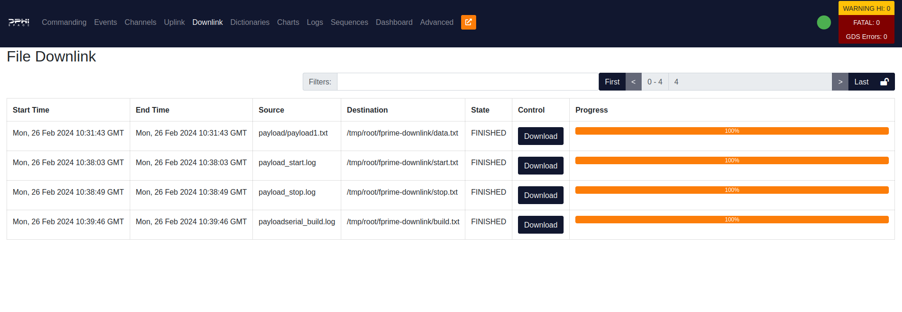

The Ground Data Segment (GDS) GUI provides a web interface to send commands to the core Flight Software (FS) and diagnostic it's status through telemetry reports and log downlink. The GDS GUI is a web application that can be directly from the browser and provides direct interface to the FS. It will not be used during the actual mission, but it is a useful tool for testing and development.

# Ground Data Segment GUI


Once the setup is done and the FSCompose is launched, we are ready to interface with the FS. The Ground Data Segment (GDS) GUI allows you to send commands to the FS and diagnostic it's status through telemetry reports and log downlink. The GDS is a web application that can be accessed, after starting the FSCompose, at :

[127.0.0.1:5000/](http://127.0.0.1:5000/)


> ⚠️ Please ensure no other service is using this port. You can verify this by running : 

- **Windows**: Run the following then kill the process in the Task Manager with the given PID.
```bash
Get-NetTCPConnection -LocalPort 5000
```

- **Unix**
```bash
sudo netstat -tulpn | grep :5000
```


## Data Folder

The payload defined in the Docker Compose will have a shared folder with the main FS container. The folder is mounted at `data/` inside the Payload container, and should be used for the data that needs to be downlinked, as well as for the data that needs to be uplinked to the FS. This is the only folder shared with the FS from the Payload Container, and provides a way to exchange data between the two containers. 

## Sharepoint Folder

This folder is used to share files between Payload Containers. It is mounted at `sharepoint/` inside the Payload container.  

## Uplink Files from GDS to Data Folder
Before we can start our Payload Container, we need to uplink the following to the FS: 

- The Dockerfile to build the Payload Container, in this example it is named **Dockerfile.payload1**, which can be found at the `payload-example/` folder.
- The necessary files to be used by the Payload Container, such as scripts, configuration files, etc. In this example, we will uplink a file named **payload1.py**, which can be found at the `payload-example/` folder.

This is done through the GDS. Once this is done, we can build the Container on the fly and start it. 


To uplink files from the GDS to the `data/` folder of your payload, first we need to transfer the file to the FS, and then access it through the Payload Docker Container: 

### Uplink to the Core Software
First we upload both files to the FS. Go to the **Uplink** Tab and and type the following destination path:

   ```bash
   /app/payload/
   ```
   
Then select both files you want to uplink and click on the **Uplink** button. This will Uplink the files to the `data/` folder inside the Payload Container.




> ⚠️ To verify the uplink was successful, check the **Events** Tab:





## Build a new Docker Container on the fly
Now that we have everything we need on board, `i.e.` the **Dockerfile.payload1** and the **payload1.py**, it is time to build the Docker Container for your Payload. To do so, go to the **Commanding** Tab and select the **dockerManager.BuildPayload** command as shown below:

   


With the arguments above, this will execute the following bash command:

   ```bash
   docker build -f Dockerfile.payload1 -t payloadserial:latest .
   ```

It will build the Docker Container using the `Dockerfile.payload1` file. The `-f` flag indicates the Dockerfile name, which needs to coincide with the one we uplinked in the previous step. The `-t` flag tags the image with the name `payloadserial:latest`. 

This might take sometime, depending on the size of the Container being built. You can check the correct execution of this command on the **Events** Tab once it's done. A build log will be created with the output of the command above. In this example it is named `payloadserial_build.log` and can be found under the `app/` folder in the **fsw** container, which is the one running the DPhi Space FS. The log's name is the same as the tag of the image plus `_build.log`, so if you change the tag, the log's name will also change.

>⚠️ You can verify the correct execution of the command in the **Events** tab: 


>⚠️  If it fails, follow the steps in the **Check Logs** Section to downlink the docker build log. 

## Update the Docker Compose and Uplink it 

Last step before we can start the Payload Container. We need to add the service to the `docker-compose.yml` file. As this is payload and setup dependent, each payload service definition might be different. We provide a template that you can modify as you see fit. Add the following below the Payload banner in the `docker-compose.yml` file, and uplink it to the FS: 

>⚠️ This step is a hotfix and will be automated in the future. Payload Providers won't need to do this in the future.  

```yaml
# FS container and GDS container definitions...
version: '3'
services:

  gds:
    # (...)
  fsw:
    # (...)

##############################################################
########################## Payloads ##########################
##############################################################

  payload:
    image: payloadserial:latest
    volumes:
      - payload:/app/data
      - sharepoint:/app/sharepoint
    networks:
      my_network:
        ipv4_address: 172.30.0.10
    #devices:
    #  - "/dev/ttyACM0:/dev/ttyUSB0"           


# Network and partitioning definitions...

```

The different configurations are : 

- `payload:` this is the service name, which you will as an argument in the GDS GUI to start and stop the container.
- `image: payloadserial:latest` this is the container image that should be run when starting this service. This is set when you build the container, after sending the `dockerManager.BuildPayload` command (previous step).
- `volumes:` this defines the (persistant) shared previously mentionned. Do not remove them, but you can add extra ones if needed.
- `networks:` defines the IP address of this service in the docker network. You can modify it if needed.
- `devices:` this is probably the most important setting, as it exposes the serial device of the host computer running the whole docker compose suite to this specific service. Meaning that, if you have an arduino connected to `/dev/ttyACM0` in the host computer, you can forward that port to this service by defining and rename it to `/dev/ttyUSB0`(so you don't have to adapt the port's name inside the service, script or executable). This is commented out for this example as the script we uplinked, `payload1.py`, does not require it.


Once you finish configuring this, uplink the `docker-compose.yml` file to the `/app` folder in the FS as shown below:

>⚠️ Make sure the added service is correctly indented with the previous ones, as it will raise an error if it is not. It needs to be added at the same level as the other services, as shown in the example above.


Now you are ready to start the Payload Container.

## Start and Stop the Payload Container

To start a payload container, which is defined in the Docker Compose, go to the **Commanding** Tab and select the **dockerManager.Start** command.


> ⚠️ The **service name** needs to match the name of the service defined on the Docker Compose as mentionned in the previous step. In the example given before, we would run the command with the argument `payload`, as shown below:

> 


Press the **SendCommand** button and the Payload Container will be started. You can correctly verify that it ran by checking the **Events** Tab as shown below:


If it fails, you will see the following Event:


>⚠️ To examine the logs and find out why it failed, follow the **Check Logs** Section below.


To stop the Payload Container, go to the **Commanding** Tab and select the **dockerManager.Stop** command. Then send it with the following arguments:


## Downlink Files from Data Folder to GDS

As previously mentionned, the only folder that is shared between a Payload Container and the DPhi Space FS Container is the `data/` folder. And as the latter one is the only one accessible through the GDS, we can only downlink files from the `data/` folder, which is mounted on the `app/payload/` in the DPhi Space FS and in the `app/data/` in the Payload Container.

The previous Payload Container example we ran created a `payload1.txt` file, and saved it in the `app/data/`. Therefore, it is accessible from the FS under the `app/payload/payload1.txt` path. To downlink it, go to the **Commanding** Tab and send the following command:



> ⚠️ We do not add the `/app/` prefix to the path, as it is the working directory of the software running the command.

> ⚠️ The second argument, *destFileName*, of the command can be anything you want, as it is the name of the file that will be downloaded to your computer.
   
Then go to the **Downlink** Tab and click on the **Download** button, as shown below. It will download to the browser as any ordinary web downloaded file.




## Check Logs

When starting, stopping or building the previous Payload Container, a total of three log files are created : 

- **payload_start.log**
- **payload_stop.log**
- **payloadserial_build.log**

These logs are created in the `app/` folder in the **fsw** container, which is the one running the DPhi Space FS. For the start and stop logs, the name of the log is the same as the payload's service defined in the Docker Compose name plus `_start.log` or `_stop.log`. For the build log, the name is the same as the tag of the image plus `_build.log`.

To downlink these logs, go to the **Commanding** Tab and send the following command:


Then go to the **Downlink** Tab and click on the **Download** button, as shown below. It will download to the browser as any ordinary web downloaded file.



   

## Next Steps
[Controlling an Arduino Nano](./examples/nano/ex-nano.md)


