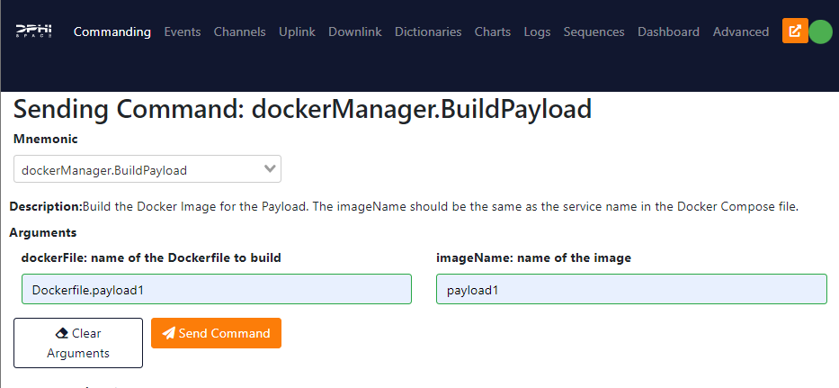

# Ground Data Segment GUI

Once the setup is done and the FSCompose is launched, we are ready to interface with the core software. The Ground Data Segment (GDS) GUI allows you to send commands to the core software and diagnostic it's status through telemetry reports and log downlink. The GDS is a web application that can be accessed, after starting the FSCompose, at :

[127.0.0.1:5000/](http://127.0.0.1:5000/)


## Create new Payload

## Start and Stop the Payload Container

To start a payload container, which is defined in the Docker Compose, go to the **Commanding** Tab and select the **dockerManager.Start** command as shown below:

   


**Attention**: The service name needs to match the name of the service defined on the Docker Compose. In this case, the service name is `payload1`. 

Press the **SendCommand** button and the Payload Container will be started. Press the **StopCommand** button to stop the Payload Container.

## Build a new Docker Container on the fly
It is also possible to build a new Docker Container for your Payload. To do that, go to the **Commanding** Tab and select the **dockerManager.BuildPayload** command as shown below:

   

This will execute the following bash command:

   ```bash
   docker build -f Dockerfile.payload1 -t payload1:latest .
   ```
You can check the correct execution of this command on the **Events** Tab.


## Data Folder

Each payload defined in the Docker Compose will have a shared folder with the main FS container. The folder is mounted at `/data/` inside the Payload container, and should be used for the data that needs to be downlinked. 

## Sharepoint Folder

This folder is used to share files between Payload Containers. It is mounted at `/sharepoint/` inside the Payload container.  

## Uplink Files from GDS to Data Folder
To uplink files from the GDS to the Data folder of your payload, first we need to transfer the file to the core software, and then access it through the payload docker container: 

### Uplink to the Core Software
First we upload the file to the Go to the **Uplink** Tab and and type the following destination path:

   ```bash
   /app/payloads/payload1
   ```
   
Then select the file you want to uplink and click on the **Uplink** button. This will Uplink this file to the `/data/` folder inside the Payload Container.


## Downlink Files from Data Folder to GDS


## Check Logs

When start or building docker containers, two log files are created : 

   


