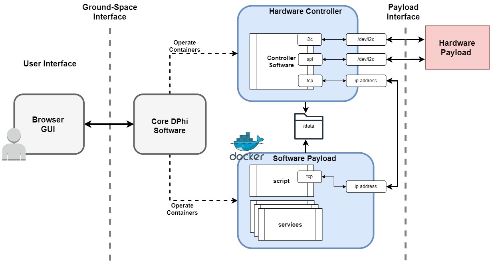
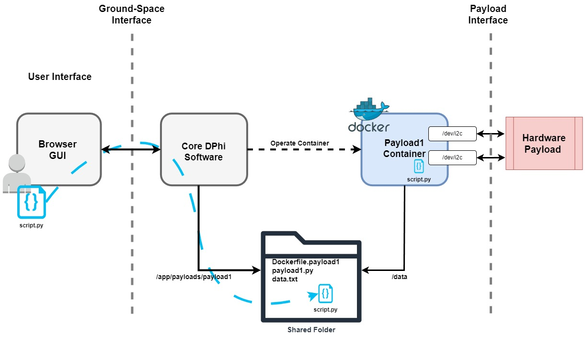

# Introduction
The FSCompose is a software suite that allows any payload provider, user or hobbyist to test and develop their payload on Earth the same way it will be deployed in space when flying with DPhi Space. Software-wise, the architecture is as shown in the image below. Here we will describe how to use this software suite during development and testing of the payload on the ground, with little to no extra hardware. 

## Architecture

The main components of the system are : 

 - **Browser GUI** The user interacts with the system through the Ground Data Segment GUI, which is launched on the web browser. Through it, commands can be sent and telemetry downlinked to and from the Core DPhi Software. For a more in-depth guide, check out the [GDS guide](./sections/gds.md) section.

 - **Core DPhi Software** The main software managing and overseeing the payloads runs on DPhi Space On-Board Computer (OBC). For testing purposes, a Docker container encapsulates the exact same software as the one in the flight model. Therefore, from a software and data point of view, running the FSCompose with this container is analogous to flying for the payloads. 

 - **Hardware Controller** The payload's software interface doesn't need to adapt to the platform, as the platform adapts to the payload. The core DPhi software does not directly interface with the payload hardware. It simply starts and stops docker containers developped by the same payload providers. Therefore, any script, service, program or shell commands developed to interface with the payload hardware from a computer during the development phase can be directly reused in FSCompose. Containarizing them ensures this hardware controllers act consistently, whether they are deployed individually, with the FSCompose or in the space segment. Furthermore, it isolates them from the rest of the underlying system. 

- **Software Payload** Some payloads may benefit from executing heavy-duty processing on the fly. This approach reduces the amount of downlinked data since data can be filtered, treated, processed, and inferred directly on the space segment. However, not all payloads possess the necessary hardware to make this a viable option within a finite amount of time, given the enormous amounts of data they produce. Thanks to the enhanced capabilities of the DPhi Space OBC, processing power can be offloaded from the payload side to the DPhi Space OBC side. Payload providers can directly forward the data they receive from their payload hardware through the payload controller directly to a [DPhi App](./sections/apps.md), or they can create their own apps in the same fashion as the Hardware Controllers.

- **Hardware Payload**: As the name implies, it is the physical component of the payload that involves tangible hardware. This can include sensors, actuators, cameras, or any other devices specific to the payload's purpose. The Hardware Payload interacts with the Hardware Controller running on the DPhi Space OBC. The flexibility of FSCompose allows streamlined integration of diverse hardware payloads, enabling users to develop and test a wide range of spaceborne instruments and equipment. Whether it's capturing sensor data, controlling actuators, or managing other hardware components, FSCompose provides a versatile environment for the development and validation of the complete payload system.

## Data Architecture

As the GDS does not directly interface with the payload, the core DPhi software and the payload container share a data folder, as depicted in the image below:

**On the core software side**, running in the DPhi Space OBC, this folder is mounted on the `/app/payloads/payload1` folder for *payload1*. If a new payload is created named *Camera*, the folder specific to that payload would be mounted at `/app/payloads/Camera`. 

**On the payload container side**, the data folder is mounted at `/data`. For the *Camera* payload it would be also `/data`, but they are not shared between payload containers for obvious data privacy and protection reasons. Meaning that *payload1* does not have access to *Camera*'s `/data` folder, and vice-versa.

Therefore, when we uplink a file destinated to *payload1*, we need to ensure we uplink it to `/app/payloads/payload1` so that the *payload1* container can access it through the aforementioned `/data` folder. This uplink is represented below.

Once the file is in the shared folder, we can directly access it from the *payload1* container (`/data/script.py` in this example).

## Next Steps

[Setup](./setup.md)